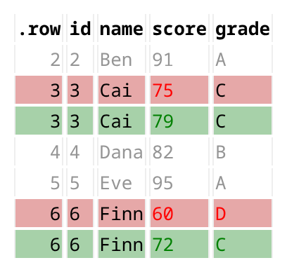

<!-- README.md is generated from README.Rmd. Please edit that file -->

# datadiffr

<!-- badges: start -->

[](https://lifecycle.r-lib.org/articles/stages.html#experimental)
[](https://opensource.org/licenses/MIT)
<!-- badges: end -->

datadiffr compares two data frames and shows you the differences the way
a code review shows you a diff: **cell by cell, with context, as a
styled HTML report**. Changed rows are lined up old-above-new, coloured
red and green, with a few unchanged rows around each change for context.

It fills the report-oriented lane for data comparison. `waldo` and
`diffdf` are excellent for console and text output; datadiffr targets
the case where you want a self-contained HTML report to read, save, or
share — and it stays actively maintained now that `dataCompareR` is
archived and `compareDF` is in maintenance mode.

## Installation

Install the development version from GitHub:

``` r
# install.packages("pak")
pak::pak("thays42/datadiff")
```

## Quick start

`compare_data()` returns the differences as a tidy data frame, with
context rows around each change. Rows are matched by position by
default, or by key columns with `by =`.

``` r
library(datadiffr)

before <- data.frame(
  id    = 1:6,
  name  = c("Ana", "Ben", "Cai", "Dana", "Eve", "Finn"),
  score = c(88, 91, 75, 82, 95, 60),
  grade = c("B", "A", "C", "B", "A", "D")
)
after <- data.frame(
  id    = 1:6,
  name  = c("Ana", "Ben", "Cai", "Dana", "Eve", "Finn"),
  score = c(88, 91, 79, 82, 95, 72),
  grade = c("B", "A", "C", "B", "A", "C")
)

compare_data(before, after, context_rows = c(1L, 1L))
#> datadiff: 2 changed, 0 added, 0 removed rows across 2 columns
#> Tolerance: 1.49011611938477e-08
#> 
#> # A tibble: 7 × 8
#>    .row .join_type .diff_type .source    id name  score grade
#>   <int> <chr>      <chr>      <chr>   <int> <chr> <dbl> <chr>
#> 1     2 both       context    <NA>        2 Ben      91 A    
#> 2     3 both       diff       x           3 Cai      75 C    
#> 3     3 both       diff       y           3 Cai      79 C    
#> 4     4 both       context    <NA>        4 Dana     82 B    
#> 5     5 both       context    <NA>        5 Eve      95 A    
#> 6     6 both       diff       x           6 Finn     60 D    
#> 7     6 both       diff       y           6 Finn     72 C
```

`diffdata()` runs the same comparison and opens it as an HTML report in
the RStudio viewer or your browser (or writes it to a file with
`output_file =`):

``` r
diffdata(before, after)
```



## How it compares

| Package | Default output | Row matching | Context rows | Status |
|----|----|----|----|----|
| **datadiffr** | Styled HTML report (+ console) | Position or key | Configurable | Active |
| waldo | Console / text | Object structure | — | Active |
| diffdf | Console / text | Key or position | — | Active |
| arsenal (`comparedf`) | Console / text | Key or position | — | Active |
| compareDF | HTML / console table | Key | Whole groups | Maintenance |
| dataCompareR | Text / HTML report | Key or position | — | Archived (CRAN 2026-02) |

datadiffr is the maintained option built around a report-quality HTML
diff with configurable context rows. It refuses to diff frames whose
columns differ in name or type, reporting the column differences instead
(see `compare_columns()`).

## Migrating from dataCompareR

datadiffr ships a clean-room `rCompare()` and friends
(`generateMismatchData()`, `saveReport()`) with the same object shape as
the archived `dataCompareR`, so existing scripts keep working. See
`vignette("migrating-from-datacomparer")`.

## License

MIT © Tyler Hays
